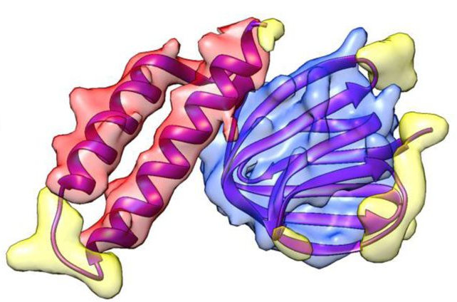

# sse-3d-seg

Secondary Structure Elements 3D Segmentation for Protein

> Picture Credit: [Cascaded-CNN: Deep Learning to Predict Protein Backbone Structure from High-Resolution Cryo-EM Density Maps](https://www.biorxiv.org/content/10.1101/572990v3.abstract)

## METRICS

- mAP

## TODO

- [ ] Preparation
  - [ ] Run baseline code & get mAP result 
  - [ ] Upload perfect data to gcp bucket tfrc-data/bio
- [ ] Synthetic Experiments
  - [ ] Run baseline code on synthetic data & get mAP result
  - [ ] Improve the mAP result on synthetic data
- [ ] Real Data Experiments
  - [ ] Run on real data
  - [ ] Improve the mAP result on real data
- [ ] Paper
  - [ ] Draft
  - [ ] Refine X 10
- [ ] Submit
  - [ ] Sep - AAAI
  - [ ] Sep - BIBM
  - [ ] Oct - RECOMB - Research of Computational Molecular Biology
  - [ ] Nov - CVPR

## DATASET

### Secondary Structure Elements

1. A - Alpha Helix
1. B - Beta Sheet
1. C - Coil / Loop
1. BG - Back Ground

### Synthetic Data (Estimated)

| $ | # |
| :---: | ---: |
| Proteins | ~1000 |
| Chains per Protein | ~10 |
| SSE per Chain | ~100 |

`1000 x 10 x 100 = 1,000,000`

Total 1M SSE.

### Real Data

To Be Load.

## AUTHORS

- Kui XU \<xukui.cs@gmail.com\> \<xuk16@mails.tsinghua.edu.cn\>
- Huan LI \<huan@bupt.edu.cn\>

## COPYRIGHTS

All rights reserved.
