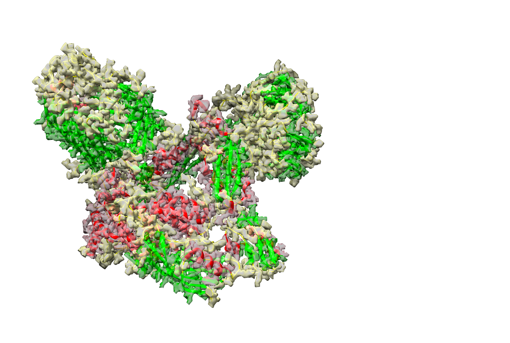

# SSE-3D-Seg Dataset

## ScreenShot




## Data Format

\*.npz format with two field:
 - *data*: 3D tensor with the shape of [W,H,L]
 - *label*: 3D tensor with the shape of [W,H,L], 
    0: BG, 1: Alpha Helix, 2: Beta Sheet, 3: Coil
 
## Sample Code for loading data   

```python
import numpy as np
emmap = np.load("5lj0.npz")
print(emmap['data'].shape)
print(emmap['label'].shape)
```

